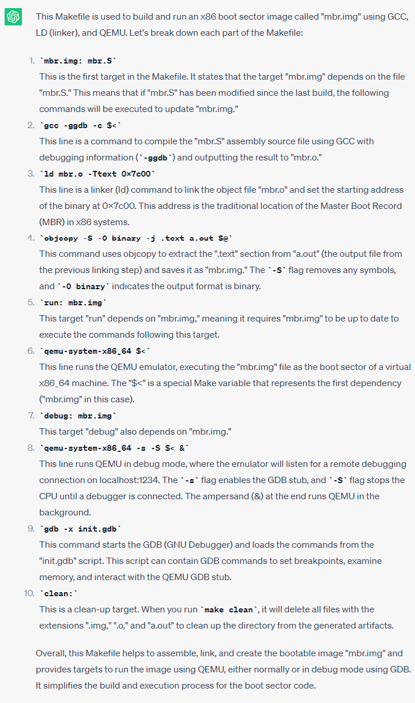
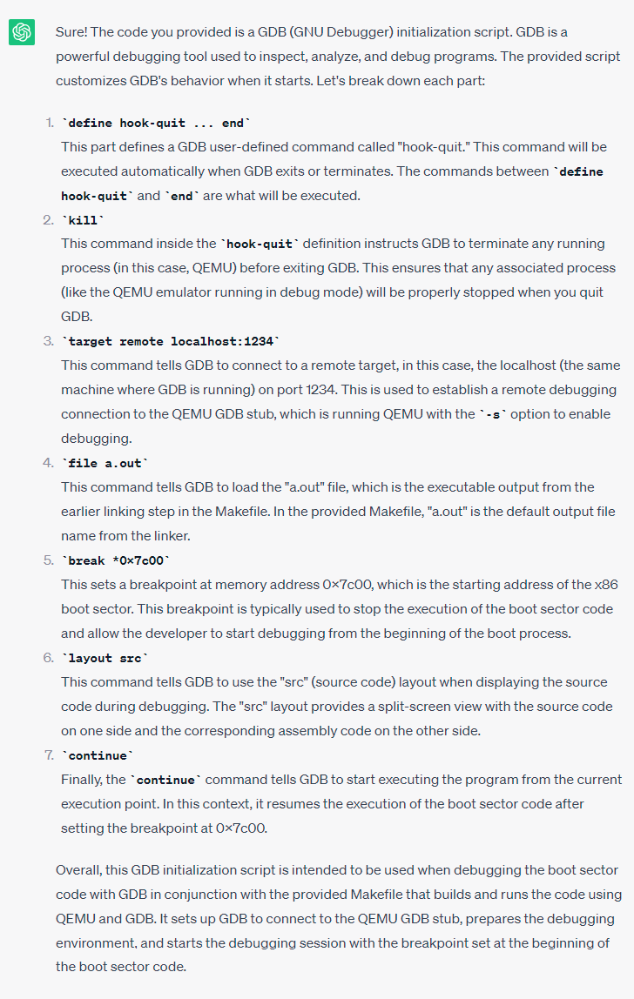
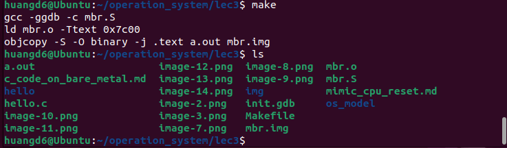
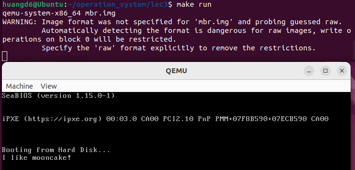
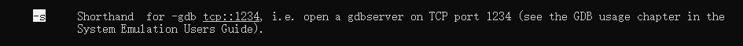
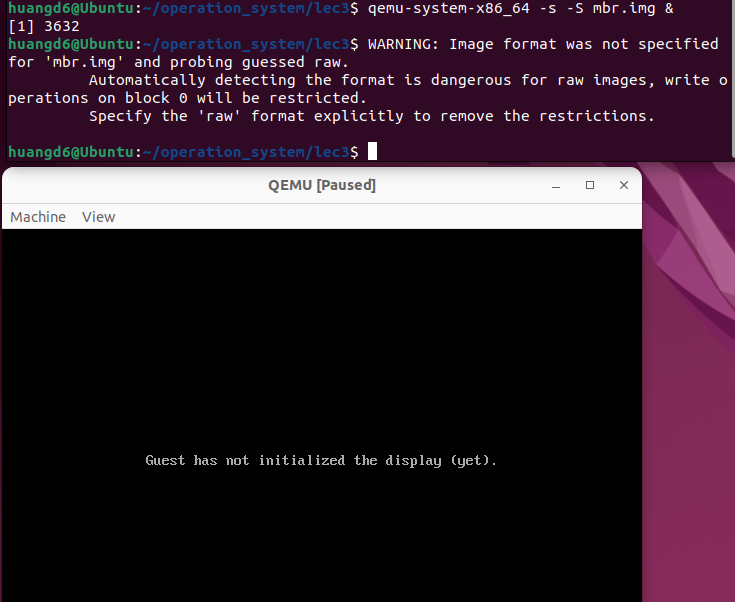
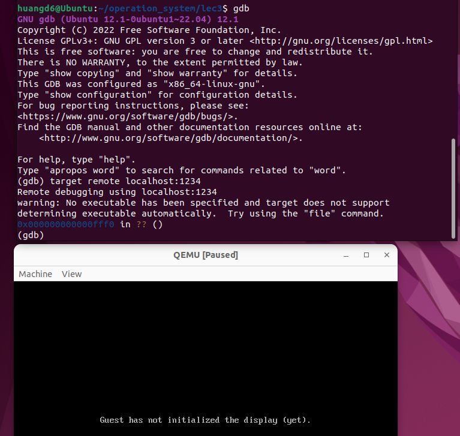
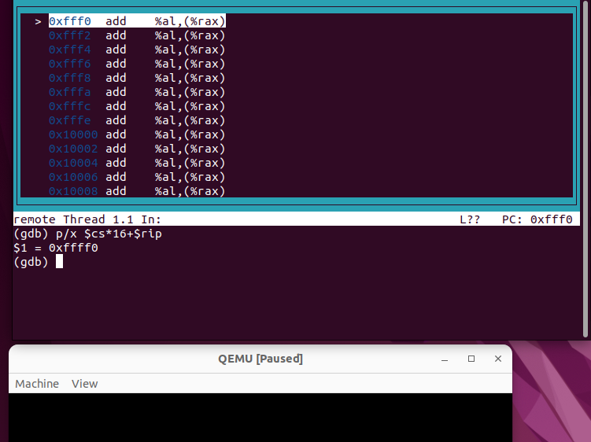
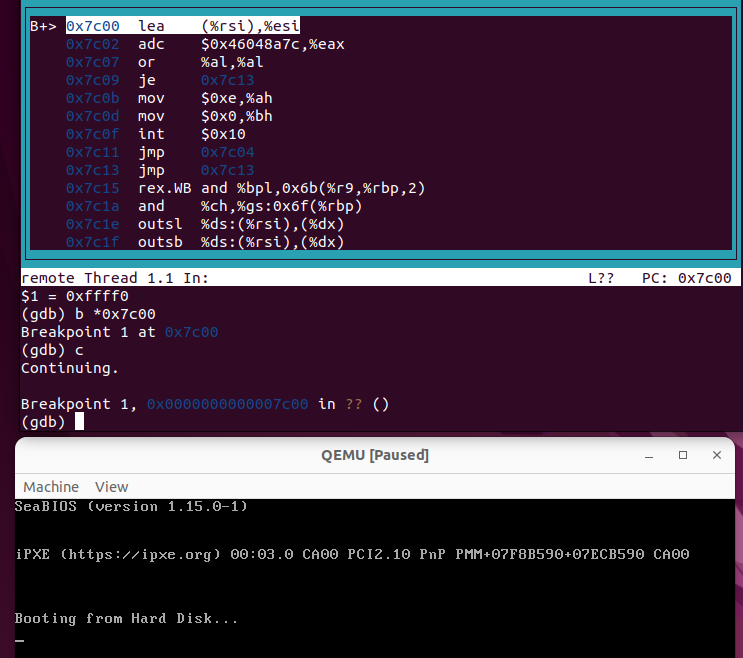
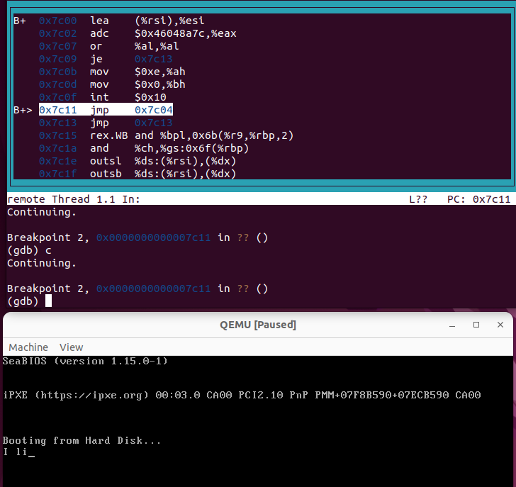

# What happens during the cpu reset process?

## 1. The workflow of CPU reset

Here we use Inter x86 cpu as an example. The reset process consist of the following steps:
+ Load firmware to the memory

When we press the reset key, the motherboard will set the cpu to a predefined state. 
For x86 CPUs, the address for loading the firmware in the memory is `0xFFFF0`, which is stored in registers CS and IP. Then CPU executes the code located at this address during the boot process, which is called the firmware. The firmware facilitates communications between the cpu and other hardware. 

There are a series of conventions and agreements among computer component manufacturers, including CPU and motherboard manufacturers, which allow the firmware in the motherboard to accurately determine its storage address in memory. This enables the CPU to fetch and execute instructions from this address, ensuring a smooth system initialization and bootloading of the OS. This example is for x86 system. The conventions could be obtained by searching CPU reset, x86, manual. 

+ Load the OS to the memory

After the firmware (BIOS or UEFI) is loaded, it will first load the first 512-byte of the first bootable device (Master Boot Record (MBR)) into the address `0x7c00` in memory. The MBR is the beginning of the OS. The MBR will perform some initializations and then start the OS. So the MBR for Linux and Windows should be different since they are starting different systems. 

The term "first bootable device" refers to the storage device identified by the firmware as the device capable of booting the operating system. This device can be a hard disk, floppy disk, or any other bootable media recognized by the system's BIOS.

+ Reset process from https://trustedfirmware-a.readthedocs.io/en/latest/_images/default_reset_code.png, the upper steps are cold boot (green band).


## 2. Experiment setup

We understand the concepts of cpu reset, now it is time to observe and confirm this process in the simulator. According to the lecturer of operation system, We are able to simulate the instruction execution after CPU reset using `QEMU`. The lecturer has provided the following codes for this purpose.


mbr.S, this file try to print a message "This is a baby step towards operating systems!" using firmware call. In my own expriment, mbr.S try to print "I like mooncake!"
```c
#define SECT_SIZE  512

.code16  // 16-bit assembly

// Entry of the code
.globl _start
_start:
  lea   (msg), %si   // R[si] = &msg;

again:
  movb  (%si), %al   // R[al] = *R[si]; <--+
  incw  %si          // R[si]++;           |
  orb   %al, %al     // if (!R[al])        |
  jz    done         //   goto done; --+   |
  movb  $0x0e, %ah   // R[ah] = 0x0e;  |   |
  movb  $0x00, %bh   // R[bh] = 0x00;  |   |
  int   $0x10        // bios_call();   |   |
  jmp   again        // goto again; ---+---+
                     //                |
done:                //                |
  jmp   .            // goto done; <---+

// Data: const char msg[] = "...";
msg:
  .asciz "This is a baby step towards operating systems!\r\n"

// Magic number for bootable device
.org SECT_SIZE - 2
.byte 0x55, 0xAA
```

Makefile
```c
mbr.img: mbr.S
	gcc -ggdb -c $<
	ld mbr.o -Ttext 0x7c00
	objcopy -S -O binary -j .text a.out $@

run: mbr.img
	qemu-system-x86_64 $<

debug: mbr.img
	qemu-system-x86_64 -s -S $< &  # Run QEMU in background
	gdb -x init.gdb  # RTFM: gdb (1)

clean:
	rm -f *.img *.o a.out
```
init.gdb

```c
# Kill process (QEMU) on gdb exits
define hook-quit
  kill
end

# Connect to remote
target remote localhost:1234
file a.out
break *0x7c00
layout src
continue
```
CHATGPT explains the meaning of commands in Makefile as follows:




CHATGPT explains the meaning of commands in init.gdb as follows:



## 3. My MBR

Is theory, we can write a MBR and put it in 0x7c00, then cpu will start the MBR. We can compile `mbr.S` to generate a binary file `mbr.img`. We can generate `mbr.img` file by typing `make`, as shown in the figure below：



If we can start `mbr.img`, then we will see a message defined in `mbr.S` in QEMU as shown below:



In the code above, `make run` is translated into `qemu-system-x86_64 mbr.img`, which means that we are starting the os `mbr.img` in the QEMU simulator. This means we could write a MBR to replace the OS. Here we implemented a MBR. This MBR only prints a message to the screen. 

## 4. Firmware start at 0xffff0, MBR start at 0x7c00

From the above description, we notice two specific pieces of information:

1. After CPU reset, the first instruction executed by the CPU is the one located at memory address 0xffff0 where the firmware is loaded.
2. The first 512-byte (Master Boot Record (MBR)) of the first bootable device is loaded into memory at address 0x7c00 by the firmware during the bootloading process.

We want to confirm the information from the code. We can debug the reset process in QEMU using gdb. There are two tips to do this:
+ we can start QEMU without running the CPU using the option `-S`, we could use `-s` to enable debugging from gdb. Note that we need to use `&` to put qemu to the background. We can see more explanation about these options in qemu-system manual.




+ we can use gdb to debug QEMU by listening to tcp::1234 port, using `target remote localhost:1234`.

First, let us start QEMU. We can see that the QEMU starts, but the firmware has not been loaded yet, since there is no message about the firmware on the screen.



Then, we can start gdb and listen to the 1234 port. 



Next, we could check if the CS::IP register is pointing to  0xffff0. Since this is 16bit assembler, we could get the pointer by `$cs * 16 + $rip`. We can see that the register do points to 0xffff0. So the first piece of information is confirmed now.



After that, we want to confirm the second point. After we start gdb, the firmware will be loaded, but it is difficult to trace the firmware. We expect that the firmware will load the MBR to 0x7c00, so we could set a breakpoint to 0x7c00. If the firmware do load MBR, then gdb will stop at 0x7c00, and we will see our `mbr.img`. 



From the figure above, we first set a breakpoint at 0x7c00 then run the gdb. We can see that 1) gdb do stop at 0x7c00 and 2) the firmware information is shown in QEMU, which means that the firmware has been loaded. We can excute for several steps in the gdb and will find it print the message one char by one char, which confirms that the assemble code is our `mbr.img`, as shown below:



Therefore, the second piece of information is also confirmed.

## 5.Conclusion

+ we could use `QEMU` to simulate the cpu reset process
+ we could use `gdb` to monitor the process step by step
+ firmware is first loaded to 0xffff0
+ MBR is then loaded to 0x7c00
+ OS is a piece of code


