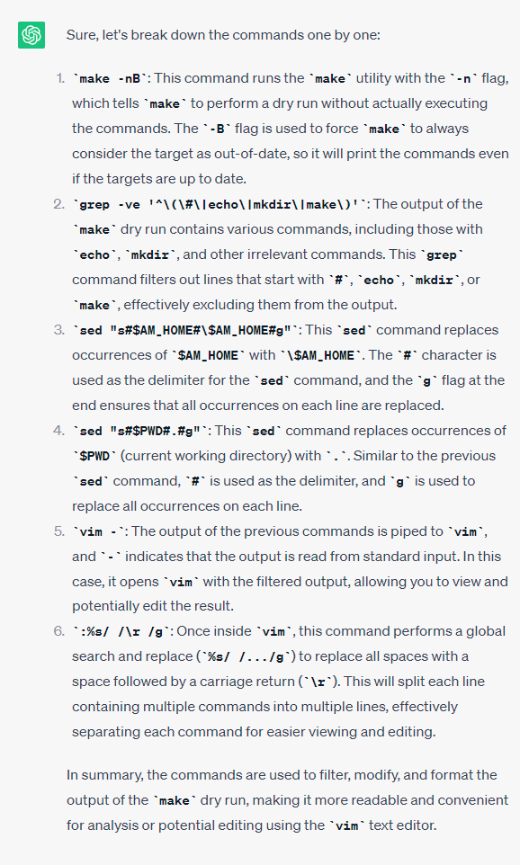

We try to illustrate that the operating system is a C code and implement a small operating system on hardware: run a small piece of C code on QEMU.

## 1. Background

We already know after CPU reset, the Firmware is first loaded to the address `0xFFFF0` in memory, after that it bootloads MBR into the address `0x7c00` in memory and then MBR starts loading the operating system. 
 
From the previous [post](./03_cpu_reset_process.md) we know that we can run our assembly code directly on hardware and the assembly code implement some functions using Firmware. The process is roughly as follows: We have a bootable assembly code of no more than 512 bytes, which displays characters on the screen by triggering BIOS (Firmware) functions. After assembling the code into an object file, we link it to the address 0x7c00 in memory using the GNU linker, and generate an image file. Next, we use QEMU to run this image file. The BIOS loads the image file into memory at address 0x7c00, starts executing its code, and displays characters on the screen.

In theory, OS is just a piece of C code. We can write a piece of C code and let it boot from `0x7c00`, then this C code is our own OS. We will show how to implement this in section 3.

To implement an OS (our own OS as C code), we need to have firmware which helps to execute certain functions on hardware. This is different to normal C code where the OS provides APIs to opertate the hardware, i.e. system calls. 


## 2. Firmware

The lecturer has provided a package [AbstractMachine](https://github.com/NJU-ProjectN/abstract-machine) for simulating the firmware. We can write our own OS based on the APIs provided by the package, so that we don't need to rely on standard C library that depends on the OS. AbstractMachine provides the following APIs:

```c
// ----------------------- TRM: Turing Machine -----------------------
extern   Area        heap;
void     putch       (char ch);
void     halt        (int code) __attribute__((__noreturn__));

// -------------------- IOE: Input/Output Devices --------------------
bool     ioe_init    (void);
void     ioe_read    (int reg, void *buf);
void     ioe_write   (int reg, void *buf);
#include "amdev.h"

// ---------- CTE: Interrupt Handling and Context Switching ----------
bool     cte_init    (Context *(*handler)(Event ev, Context *ctx));
void     yield       (void);
bool     ienabled    (void);
void     iset        (bool enable);
Context *kcontext    (Area kstack, void (*entry)(void *), void *arg);

// ----------------------- VME: Virtual Memory -----------------------
bool     vme_init    (void *(*pgalloc)(int), void (*pgfree)(void *));
void     protect     (AddrSpace *as);
void     unprotect   (AddrSpace *as);
void     map         (AddrSpace *as, void *vaddr, void *paddr, int prot);
Context *ucontext    (AddrSpace *as, Area kstack, void *entry);

// ---------------------- MPE: Multi-Processing ----------------------
bool     mpe_init    (void (*entry)());
int      cpu_count   (void);
int      cpu_current (void);
int      atomic_xchg (int *addr, int newval);

```
In last [post](./03_cpu_reset_process.md), we use an assembly code `mbr.S` to simulate the OS, which print a message to the screen by calling (manipulating registers) a firmware function.

The AbstractMachine provide more comprehensive functions that allow us to operate the hardware.


## 3. Operating system implementation


### 3.1 Hello OS

The lecturer provide us a C code `hello.c` which prints a red string "Hello, OS World", and a Makefile file. To run hello.c, we need to set the `AM_HOME` environment variable to the `absolute path` where the AbstractMachine is located in our computer.

hello.c
```c
#include <am.h>

#define ESC "\033["
#define RED ESC "01;31m"
#define CLR ESC "0m"

const char *MESSAGE = RED "Hello, OS World\n" CLR;

int main() {
  for (const char *s = MESSAGE; *s; s++) {
    putch(*s);  // Prints to platform-dependent debug console
  }
}

```
We can see that this code include `am.h` instead of the normal `stdio.h`.

Makefile

```c
NAME := hello
SRCS := hello.c
export ARCH := x86_64-qemu

include $(AM_HOME)/Makefile

```
We can compile and run hello.c as following:


We can see that hello.c serves as an operating system. Its function is only to print a message  "Hello, OS World". In the compilation process, we compiled the AbstractMachine to be used as the firmware. We also compiled the hello.c into an image file hello to be used as the OS.


### 3.2 Multi-thread OS

Similarly, we can implement a multi-thread OS given by `kernel.c`:

```c
#include <am.h>
#include <klib.h>
#include <klib-macros.h>

typedef union task {
  struct {
    const char *name;
    union task *next;
    void      (*entry)(void *);
    Context    *context;
  };
  uint8_t stack[8192];
} Task;

Task *current;

void func(void *arg) {
  while (1) {
    putch(*(char *)arg);
    for (int volatile i = 0; i < 100000; i++) ;
  }
}

Task tasks[] = {
  { .name = "a", .entry = func },
  { .name = "b", .entry = func },
};

Context *on_interrupt(Event ev, Context *ctx) {
  if (!current) {
    current = &tasks[0];
  } else {
    current->context = ctx;
  }
  return (current = current->next)->context;
}

int main() {
  cte_init(on_interrupt);  // call on_interrupt() on traps/interrupts

  for (int i = 0; i < LENGTH(tasks); i++) {
    Task *task    = &tasks[i];
    Area stack    = (Area) { &task->context + 1, task + 1 };
    task->context = kcontext(stack, task->entry, (void *)task->name);
    task->next    = &tasks[(i + 1) % LENGTH(tasks)];
  }
  iset(true);  // Enable external interrupts (timer, I/O, ...)
  yield();  // Trap
}
```
The code is difficult to understand at this stage. The `Task` represents a thread. The OS is switchinng between Task a and Task b.

By specifying SRCS := kernel.c in the Makefile, we can compile and run kernel.c as follows:


By typing the command "make run", kernel.c runs. It switch between two tasks: print 'a' and print 'b'.


kernel.c simulates a small multi-threaded operating system.


## 4. Conclusion

- OS is a piece of C code, but it relys on APIs of firmware
- AbstractMachine provides comprehensive APIs for implementing OS

## 5. MISC  

`Bare-metal` means a computing environment where software runs directly on hardware without any intervening layers of abstraction or operating systems.

To compile the AbstractMachine, I set the `AM_HOME` environment variable(in Makefile) to a relative path (~/AbstractMachine). The program cannot be compiled correctly since `~` is not translated in the compilation process. After switching to absolute path, the compilation works. 

To better understand the Makefile in AbstractMachine, we could use the following commands: 

```c
make -nB \
  | grep -ve '^\(\#\|echo\|mkdir\|make\)' \
  | sed "s#$AM_HOME#\$AM_HOME#g" \
  | sed "s#$PWD#.#g" \
  | vim -

:%s/ /\r /g  
```
- `make -nB` shows the concrete compilation commands in the build process. 
- `grep -ve '^\(\#\|echo\|mkdir\|make\)'` remove lines starting with `#`,`echo`,`mkdir`and `make`.
- `sed "s#$AM_HOME#\$AM_HOME#g" ` replace the absolute path with literal string `$AM_HOME`.
- `sed "s#$PWD#.#g" ` replace current directory with `.`.
- `:%s/ /\r /g` split a line by space in vim.

Example of split command `:%s/ /\r /g`:


The detailed explanation are given by ChatGPT




