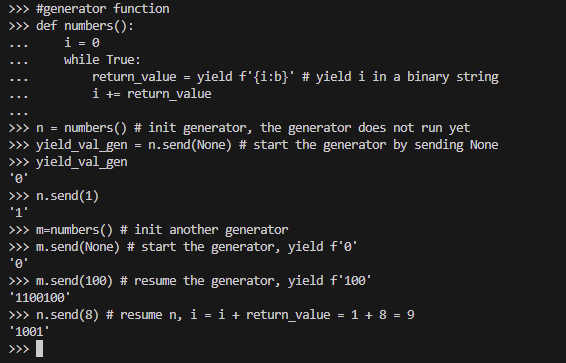
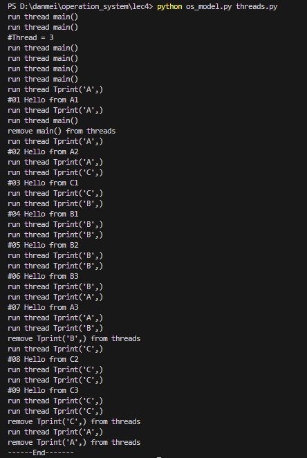
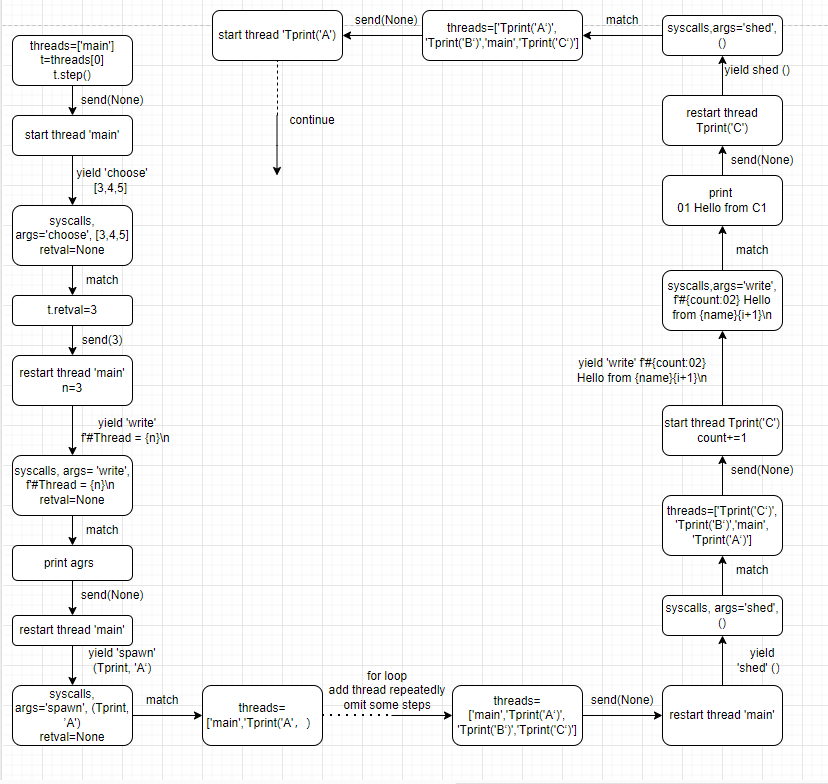

In this post, we try to implement a toy operating system using Python to simulate the behavior of a real operating system. We hope to illustrate the basic ideas of the operating system through this toy example. 

# 1. Background

From the perspective of software, an application can be viewed as a composition of pure computations and system calls (services provided by the operating system). The operating system is responsible for implementing these system calls, e.g. interacting with I/O devices, scheduling different processes.

In a real OS, there are multiple applications (processes) running concurrently in the OS, such as browsers, music players and so on. The operating system schedules these applications (processes) in time-sharing, i.e. all processes run alternatively in a random order. From the users' perspective, all applications are executing concurrently.

To simulate the real operating system, we need to implement:
- Multi-process/multi-thread
- System calls(APIs), including time-sharing scheduling of processes/threads

# 2. Software Design

## 2.1 Process / thread

The first thing is that we need to implement the process/thread. Processes do not shared memory and threads shared memmory. A process may consist of multiple threads. For simplicity, we simulate multiple processes using the following code:

threads.py

```python
count = 0

def Tprint(name):
    global count
    for i in range(3):
        count += 1
        sys_write(f'#{count:02} Hello from {name}{i+1}\n')
        sys_sched()

def main():
    n = sys_choose([3,4,5])
    sys_write(f'#Thread = {n}\n')
    for name in 'ABCDE'[:n]:
        sys_spawn(Tprint, name)
    sys_sched()

```
Here Tprint() simulates a process, but we call it a thread as there is a shared variable `count`. The `main()` funtion simulates generating n threads, and requests the services provided by the operating system through 4 system calls: sys_choose(), sys_write(), sys_spawn(), sys_sched(). These services include threads scheduling.

## 2.2 Four basic system calls (APIs)

As mentioned in the previous section, the OS provides system calls. Here we propose to implement the following system calls:

- `choose(xs)`: return a random choice from `xs`. This system call helps to provide a random choice.
- `write(s)`: output string `s`. This system call simulates interacting with I/O. 
- `spawn(fn)`: create a runnable thread `fn`. This system call simulates initiating a thread.
- `sched()`: randomly switch to any thread execution. This system call simulates switching from one thread to another thread.


## 2.3 Generator as thread

These system calls `choose(xs)`, `write(s)`, `spawn(fn)` are relatively easy to implement, while `sched()` is a bit difficult. To simulate the scheduling of different processes, there are two key points: 
- switch the state machine (process/thread) to different states
- excute a single step (time slot) of each thread to simulate the time-sharing mechanism

For thread switching, we need to store and restore the states (local variables, global variables, program counter etc) of the threads, as illustrated in the non-recursive Hanoi post. For single step execution, we need to be able to set a breakpoint in a thread.

Fortunately, Python provides us a great data structure `generator` for state storage and restoration， as well as pausing the generator. Let us illustrate how `generator` could satisfy these requirements using the following example.

```python
#generator function
def numbers():
    i = 0
    while True:
        return_value = yield f'{i:b}' # yield i in a binary string
        i += return_value
```
This generator yields the local variable `i` as a binary string to the outside caller. The outside caller could send a value to the local variable `return_value`. Here we create two generators `n` and `m` to show how to do this. 

```python
#caller
n = numbers() # init generator, the generator does not run yet
yield_val_gen = n.send(None) # start the generator by sending None
# the generator yield the binary string of i, pauses, assign it to yield_val_gen
# yield_val_gen = f'0'

yield_val_gen = n.send(1) # resume the generator by sending 1
# the caller send 1 to the generator and assign it to return_value, i.e. left handside of yield
# return_value = 1
# i = i + return_value = 0 + 1 = 1, continue until next yield
# yield f'1'
# yield_val_gen = f'1', n pauses

m=numbers() # init another generator
m.send(None) # start the generator, yield f'0'
m.send(100) # resume the generator, yield f'100'

n.send(8) # resume n, i = i + return_value = 1 + 8 = 9
# 9 = 2^3 + 2^0 => f'1001', yield f'1001'
```

Here is the outcome.  



Note that 
- the generator doesn't run upon initialization
- the generator starts by sending a None
- the generator keeps running until it encounters a `yield`
- the generator passes a value to the caller by `yield`
- the caller passes a value to the generator by `send()` (left hand side variable of the paused `yield`)
- the generator keeps track of all local variables so there is no need to use a stack to store and restore them

In summary, we could use generator to store the states and set breakpoints for a program.

# 3. Implementation

## 3.1 Toy OS model

The toy operating system `os_model.py` is given by:

```python
import sys
import random
from pathlib import Path

class OperatingSystem():
    """A minimal executable operating system model."""

    SYSCALLS = ['choose', 'write', 'spawn', 'sched']

    class Thread:
        """A "freezed" thread state."""

        def __init__(self, func, *args):
            self._func = func(*args)
            self.retval = None
            self._name=f'{func.__name__}{args}'

        def step(self):
            """Proceed with the thread until its next trap."""
            syscall, args, *_ = self._func.send(self.retval)
            self.retval = None
            return syscall, args

    def __init__(self, src):
        variables = {}
        exec(src, variables)
        self._main = variables['main']

    def run(self):
        threads = [OperatingSystem.Thread(self._main)]
        while threads:  # Any thread lives
            print(f'run thread {threads[0]._name}')
            try:
                match (t := threads[0]).step():
                    case 'choose', xs:  # Return a random choice
                        t.retval = random.choice(xs)
                    case 'write', xs:  # Write to debug console
                        print(xs, end='')
                    case 'spawn', (fn, args):  # Spawn a new thread
                        threads += [OperatingSystem.Thread(fn, *args)]
                    case 'sched', _:  # Non-deterministic schedule
                        random.shuffle(threads)
            except StopIteration:  # A thread terminates
                threads.remove(t)
                print(f'remove {t._name} from threads')
                random.shuffle(threads)  # sys_sched()

if __name__ == '__main__':
    if len(sys.argv) < 2:
        print(f'Usage: {sys.argv[0]} file')
        exit(1)

    src = Path(sys.argv[1]).read_text() # read source code threads.py
    for syscall in OperatingSystem.SYSCALLS:
        src = src.replace(f'sys_{syscall}',        # sys_write(...)
                          f'yield "{syscall}", ')  #  -> yield 'write', (...)

    OperatingSystem(src).run()

# run this code:
# python os_model.py threads.py
```
The first key point of this code is the treatment of `syscall` functions. All `syscall` functions are converted into generator functions. The converted source code of `threads.py` are given by

```python
# converted thread.py
count = 0

def Tprint(name):     
    global count      
    for i in range(3):
        count += 1
        yield "write", (f'#{count:02} Hello from {name}{i+1}\n')
        yield "sched", ()

def main():
    n = yield "choose", ([2])
    yield "write", (f'#Thread = {n}\n')
    for name in 'ABCDE'[:n]:
        yield "spawn", (Tprint, name)
    yield "sched", ()
```

This converted source code is then used to initiate an `OperatingSystem` object. In the initialization, the following line compiles the source code into generator functions (`Tprint(name)` and `main()`), which is stored in the dictionary `variables`. The `main()` generator is then stored. Note that `count` is loaded as a global variable after the execution. 
```python
exec(src, variables)
```

The second key point is the implementation of the class `Thread()`, which is based on the generator introduce in the previous section. `Thread()` has four elements
- `_func` is a generator object that represents a thread
- `retval` is the value a caller sends into the thread
- `syscall, args` are the yield values the thread return back to the caller
- `step()` simulates the single execution step in a time-sharing OS

The toy operating system uses the list `threads` to store all threads. In the beginning, the list only contains the `main()` thread. The `main()` thread then initiates `n` `Tprint` threads (objects), each with a different name, e.g. Tprint('B',), Tprint('C',). This OS always picks the first thread in this list and run it. The `sched()` syscall shuffles the list, which ensures that each thread is randomly scheduled. When a generator has reached its end point, it will be removed from the `threads` list. 

The last point worth noticing is that the global variable `count` keeps track of the execution order of different threads. 

## 3.2 Simulation Results and Flowchart

From the simulation results below, we can see that the threads randomly switch without interfering with each other, as A => C => B. We can see that the `main()` thread is removed from the list after executing `A1`. The count value increase in a stepwise way, which shows the execution order of the OS. 



The following Flowchart shows the detailed state transitions of the above process. 




# 4. Conclusion

We have used generator to implement a toy OS. This OS helps us to easily draw the state transitions, which is super difficult in C implementations. This simple experiment shows the concurrent scheduling of OS. 


