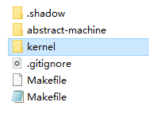

We need to write a program that runs directly on [AbstractMachine](https://github.com/NJU-ProjectN/abstract-machine) (only enabling the IOE extension, without using other hardware mechanisms such as interrupts/exceptions/virtual storage/multiprocessors), to display any image. The image contains no fewer than 10 colors; it should adapt to different screen sizes; calling halt() after pressing the ESC key to exit; besides this, the program should not exit when any other key is pressed.

# 1. Background

In the previous lecture, the lecturer provided us a package [AbstractMachine](https://github.com/NJU-ProjectN/abstract-machine), which is a C Runtime environment on bare-metal, providing 5 main sets of APIs for accessing hardware. We can implement various system software, including operating systems, based on the AbstractMachine.

## 1.1 AbstractMachine Overview

AbstractMachine enables us to implement an operating system without understanding the details of hardware mechanisms. 

AbstractMachine abstracts the hardware mechanisms into the following 5 sets of C APIs. It shields trivial hardware details, helping beginners understand the essence of computer systems.

+ (TRM) putch/halt - Basic computation, display, and halting
+ (IOE) ioe_read/ioe_write - I/O Device management
+ (CTE) ienabled/iset/yield/kcontext - Interrupts and exceptions
+ (VME) protect/unprotect/map/ucontext - Virtual memory management
+ (MPE) cpu_count/cpu_current/atomic_xchg - Multiprocessor

## 1.2 C programs on an operating system and Bare-metal

C programs on both operating systems and Bare-metal need to go through the processes of compilation, linking, and loading for execution. However, there are differences in the details.


# 2. Experiment

## 2.1 Get the experimental framework code

On the command line execute:

```
$ git clone https://git.nju.edu.cn/jyy/os-workbench.git
$ git pull origin L0 
```

Clone os-workbench into the current directory. Get the framework code. We always work in the kernel directory, which contains two files: kernel.c and Makefile.



Makefile, in which we need to replace the relative path `PWD` with an absolute path.
```
NAME := kernel
SRCS := kernel.c
export MODULE  := L0
export AM_HOME := $(PWD)/../abstract-machine
ifeq ($(ARCH),)
export ARCH := x86_64-qemu
endif

include $(AM_HOME)/Makefile
include ../Makefile.lab
image: git
```

kernel.c initializes AbstractMachine, displays a startup screen consisting of alternating white and black squares, and continuously prints the key codes of pressed keys on the screen.
```c
#include <am.h>
#include <amdev.h>
#include <klib.h>
#include <klib-macros.h>

#define SIDE 16

static int w, h;  // Screen size

#define KEYNAME(key) \
  [AM_KEY_##key] = #key,
static const char *key_names[] = { AM_KEYS(KEYNAME) };

static inline void puts(const char *s) {
  for (; *s; s++) putch(*s);
}

void print_key() {
  AM_INPUT_KEYBRD_T event = { .keycode = AM_KEY_NONE };
  ioe_read(AM_INPUT_KEYBRD, &event);
  if (event.keycode != AM_KEY_NONE && event.keydown) {
    puts("Key pressed: ");
    puts(key_names[event.keycode]);
    puts("\n");
  }
}

static void draw_tile(int x, int y, int w, int h, uint32_t color) {
  uint32_t pixels[w * h]; // WARNING: large stack-allocated memory
  AM_GPU_FBDRAW_T event = {
    .x = x, .y = y, .w = w, .h = h, .sync = 1,
    .pixels = pixels,
  };
  for (int i = 0; i < w * h; i++) {
    pixels[i] = color;
  }
  ioe_write(AM_GPU_FBDRAW, &event);
}

void splash() {
  AM_GPU_CONFIG_T info = {0};
  ioe_read(AM_GPU_CONFIG, &info);
  w = info.width;
  h = info.height;

  for (int x = 0; x * SIDE <= w; x ++) {
    for (int y = 0; y * SIDE <= h; y++) {
      if ((x & 1) ^ (y & 1)) {
        draw_tile(x * SIDE, y * SIDE, SIDE, SIDE, 0xffffff); // white
      }
    }
  }
}

// Operating system is a C program!
int main(const char *args) {
  ioe_init();

  puts("mainargs = \"");
  puts(args);  // make run mainargs=xxx
  puts("\"\n");

  splash();

  puts("Press any key to see its key code...\n");
  while (1) {
    print_key();
  }
  return 0;
}

```
The output of original kernel.c


## 2.2 Obtain uncompressed image data

The xxd tool can convert any image binary file into a constant array acceptable by C/C++.

Taking autumn.bmp as an example, it is a BMP file with a resolution of 600 * 400 and contains no fewer than 10 colors.

autumn.bmp


After xxd processing, a header file named autumn.h will be generated, which contains a hexadecimal array autumn_bmp[], with a length of 600 * 400 * 3 + 54 = 720054. This array includes File Header (14 bytes) + Information Header (40 bytes) + Pixels RGB Data. We delete the previous 54 bytes of the array. What remains are the RGB values corresponding to all pixels.


```
xxd -i autumn.bmp > autumn.h
```

To facilitate subsequent use, we need to do some processing on the original RGB values. Merge the three hexadecimal RGB values for each pixel into a 24-bit hexadecimal value. The following is the content of the automn.h:

```c
#include <stdint.h>

unsigned char autumn_bmp[] = {
  0x00, 0x1b, 0x2b, 0x3b, 0x97, 0xa8,
  ......
}
unsigned int autumn_bmp_len = 720000;

//Merge the three hexadecimal RGB values for each pixel into a 24-bit hexadecimal value.
// Create an array to store merged values
uint32_t image_array[240000];

int merge_bytes() {
    // Merge the bytes
    for (int i = 0; i < autumn_bmp_len; i += 3) {
        image_array[i / 3] = ((uint32_t)autumn_bmp[i+2] << 16) | ((uint32_t)autumn_bmp[i + 1] << 8) | autumn_bmp[i];
    }
    return 0;
}
```
We can also use some image processing modules of Python to obtain and verify image data, which will not be discussed in detail here.

## 2.3 Implementation and results

To achieve the experimental requirements, we need to understand the code in AbstractMachine. The answers to the following questions can be found in the code. To better read the code, it is necessary to understand APIs, library functions and macros defined in AbstractMachine first (see am.h klib.h klib-macros.h).

1. After initialization of the I/O devices, what does AbstractMachine do when reading or writing registers (see ioe.c). How registers and keyboards are defined and mapped (see amdev.h).
2. How to obtain screen information and draw pictures by reading and writing AM_GPU_CONFIG and AM_GPU_FBDRAW registers (see gpu.c ioe.c).
3. After initializing AbstractMachine, how to monitor keyboard events (see input.c) and read keyboard inputs (see input.c ioe.c).
4. How to exit after receiving ESC key input (see trm.c).

Below is our code, new kernel.c

```c
#include<am.h>
#include<amdev.h>
#include<klib.h>
#include<klib-macros.h>
#include "autumn.h"
#include<stdint.h>

static int w, h;  // Screen size

//image size 
#define img_w 600
#define img_h 400

#define KEYNAME(key) \
  [AM_KEY_##key] = #key,
static const char *key_names[] = { AM_KEYS(KEYNAME) };

static inline void puts(const char *s) {
  for (; *s; s++) putch(*s);
}

void print_key() {
  AM_INPUT_KEYBRD_T event = { .keycode = AM_KEY_NONE };
  ioe_read(AM_INPUT_KEYBRD, &event);

  if (event.keycode == AM_KEY_ESCAPE && event.keydown){
    halt(1);
  }else if (event.keycode != AM_KEY_NONE && event.keydown){
    puts("Key pressed: ");
    puts(key_names[event.keycode]);
    puts("\n");
  }
}

int main(const char *args){
    ioe_init();

    puts("mainargs = \"");
    puts(args);
    puts("\"\n"); 
    
    merge_bytes(); //autumn.h

    AM_GPU_CONFIG_T info={0};
    ioe_read(AM_GPU_CONFIG, &info);
    w=info.width;
    h=info.height;

    //Map pixels proportionally to the screen and draw pixels row by row
    uint32_t color[w];
    float scale_w=(float)w/img_w;
    float scale_h=(float)h/img_h;

    for (int j=h-1; j>=0; j--){
      for (int i=0; i<w; i++){
        int image_array_i=(int)(i/scale_w);
        int image_array_j=(int)(j/scale_h);
        color[i]=image_array[image_array_j*img_w+image_array_i];
      }

      AM_GPU_FBDRAW_T event={
        .x=0, .y=h-1-j, .w=w, .h=1, .sync=1,
        .pixels=color,
      };
      ioe_write(AM_GPU_FBDRAW, &event);

    }
    
    puts("Press any key to see its key code...\n");
    while (1) {
        print_key();
    }
    return 0;
}
```
Use Makefile to compile, link, load and run kernel.c. Our outputs are as follows.

autumn.bpm is displayed in QEMU and it can adapt to screen size.


Press ESC key to exit.


The program should not exit when any other key is pressed.


# 3. Conclusion

Unlike C programs on operating systems, programs on AbstractMachine have more control over the computer hardware system. We can write non-trivial programs on bare-metal, directly interact with physical devices using I/O instructions and memory-mapped I/O, read keys, update the screen, and so on.


